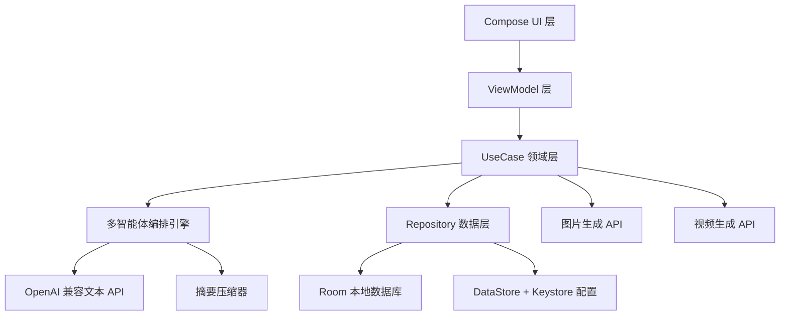
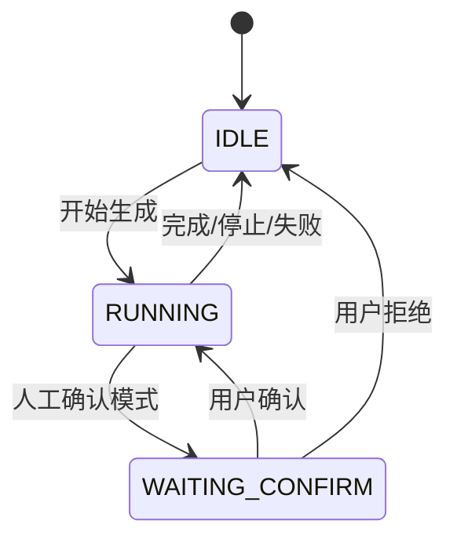

# AI Novel Writer 技术设计规格说明书

Feature Name: ai-novel-writer
Updated: 2026-08-07

## Description

单机 Android AI 小说创作应用。内置多智能体专家管线（世界观架构师、大纲规划师、章节作者、连续性编辑、润色编辑），调用用户自配的 OpenAI 兼容 API 生成连贯的小说章节，支持图片/视频生成、书架管理、历史记录、流式输出与本地持久化。

## Architecture



### 架构说明

- **分层结构**: UI(Compose) → ViewModel → UseCase → Repository → 数据源
- **单向数据流**: 使用 StateFlow 承载 UI 状态，事件经 ViewModel 分发
- **依赖注入**: 使用 Hilt 管理依赖
- **协程**: 使用 Kotlin Coroutines + Flow 处理异步与流式响应
- **多智能体管线**: Agent 编排器串行/并行调用各专家角色，形成创作流水线

## Components and Interfaces

### 1. 多智能体编排引擎 (Agent Orchestrator)

**职责**: 组织专家角色形成创作管线，维护上下文会话，管理生成流程状态。

**专家角色定义** (AgentDefinition):
- `id`、`name`、`systemPrompt`、`temperature`、`maxTokens`
- 内置角色:
  - `worldview-architect` 世界观架构师
  - `outline-planner` 大纲规划师
  - `chapter-author` 章节作者
  - `continuity-editor` 连续性编辑
  - `polish-editor` 润色编辑

**接口**:
- `suspend fun runPipeline(novel: Novel, mode: CreationMode): Flow<PipelineEvent>`
- `suspend fun generateWorldview(request: WorldviewRequest): Worldview`
- `suspend fun generateChapter(request: ChapterRequest): Chapter`
- `suspend fun verifyContinuity(chapter: Chapter, context: NovelContext): ContinuityReport`
- `suspend fun cancelCurrentJob()`

### 2. LLM 客户端 (LlmClient)

**职责**: 封装 OpenAI 兼容 Chat Completions 协议，支持流式与非流式。

**接口**:
- `suspend fun streamChat(messages: List<ChatMessage>, config: ModelConfig): Flow<ChatChunk>`
- `suspend fun chat(messages: List<ChatMessage>, config: ModelConfig): ChatResponse`
- `fun buildMessages(context: List<AgentMessage>): List<ChatMessage>`

**配置** (ModelConfig):
- `baseUrl`、`apiKey`、`model`、`temperature`、`maxTokens`

**错误映射**:
- `401` → 鉴权失败
- `429` → 限流
- `5xx` → 服务端错误
- 网络异常 → 网络不可用

### 3. 上下文管理器 (ContextManager)

**职责**: 组装注入到 LLM 的上下文，保证连贯性。

- 注入优先级: 世界观设定 → 大纲 → 角色卡 → 最近 N 章全文 → 历史摘要
- 超过 token 预算时，对最早期章节调用 `SummaryCompressor` 压缩为摘要

**接口**:
- `suspend fun buildPromptContext(novel: Novel, currentChapterIndex: Int): NovelContext`
- `fun estimateTokenCount(text: String): Int`

### 4. 摘要压缩器 (SummaryCompressor)

**职责**: 将过期章节压缩为摘要以节省 token 上下文。

- 采用「渐进式摘要」: 每章首次压缩保留详细摘要，再次压缩时合并
- 缓存摘要于数据库，避免重复压缩

### 5. 创作会话 (CreationSession)

**职责**: 管理单次创作对话的会话状态。

**状态机**:


**接口**:
- `fun newSession(novelId: Long): CreationSession`
- `fun pause()`、`fun resume()`、`fun cancel()`
- `val events: SharedFlow<CreationEvent>`

### 6. Repository 层

- `NovelRepository`: 书籍 CRUD、章节 CRUD、进度
- `HistoryRepository`: 调用历史记录 CRUD
- `SettingRepository`: 配置读写（Keystore 加密）
- `AssetRepository`: 生成图片/视频的本地文件管理

### 7. 媒体生成客户端

- `ImageClient`: 调用兼容文生图 API（`POST /images/generations`），支持 Base64/URL 回写本地
- `VideoClient`: 调用文生视频 API，异步任务轮询结果

## Data Models

### Novel (书籍)
```kotlin
@Entity
data class Novel(
    @PrimaryKey(autoGenerate = true) val id: Long = 0,
    val title: String,
    val synopsis: String,
    val genre: String,
    val coverPath: String?,
    val worldviewId: Long?,
    val outlineId: Long?,
    val status: NovelStatus,
    val currentChapterIndex: Int,
    val createdAt: Long,
    val updatedAt: Long
)
```

### Chapter (章节)
```kotlin
@Entity
data class Chapter(
    @PrimaryKey(autoGenerate = true) val id: Long = 0,
    val novelId: Long,
    val title: String,
    val content: String,
    val summary: String?,
    val indexInNovel: Int,
    val status: ChapterStatus,
    val createdAt: Long,
    val updatedAt: Long
)
```

### AgentMessage / ChatMessage
```kotlin
data class ChatMessage(val role: Role, val content: String)
enum class Role { SYSTEM, USER, ASSISTANT }
```

### Worldview (世界观设定)
```kotlin
@Entity
data class Worldview(
    @PrimaryKey(autoGenerate = true) val id: Long = 0,
    val novelId: Long,
    val characters: String,
    val geography: String,
    val rules: String,
    val timeline: String,
    val rawText: String,
    val createdAt: Long
)
```

### HistoryRecord (历史记录)
```kotlin
@Entity
data class HistoryRecord(
    @PrimaryKey(autoGenerate = true) val id: Long = 0,
    val novelId: Long?,
    val agentRole: String,
    val inputSummary: String,
    val outputText: String,
    val status: TaskStatus,
    val createdAt: Long
)
```

### 状态枚举
- `NovelStatus`: DRAFT, WORLDVIEW_DONE, OUTLINED, WRITING, COMPLETED
- `ChapterStatus`: PENDING, GENERATING, DRAFT, EDITED, FINAL
- `TaskStatus`: SUCCESS, FAILED, CANCELLED

## Correctness Properties

1. **数据一致性**: 删除书籍时级联删除其章节、设定、历史记录（外键 ON DELETE CASCADE）
2. **上下文预算**: 注入 LLM 的上下文总 token 数不得超过配置窗口的 60%，超出部分由摘要压缩处理
3. **管线状态机**: 任何时刻同一书籍仅存在一个 RUNNING 创作会话，取消后必须回到 IDLE
4. **API Key 保护**: 明文 API Key 仅存在于内存，磁盘存储必须经 Keystore 加密
5. **章节序号唯一性**: 同一书籍内 `indexInNovel` 唯一且连续
6. **流式幂等**: 取消流式任务后，已接收内容必须完整写入数据库

## Error Handling

| 场景 | 处理策略 |
|------|---------|
| API 401 鉴权失败 | 提示检查 Key 与 BaseUrl，不重试 |
| API 429 限流 | 指数退避重试最多 3 次，展示等待提示 |
| 网络不可用 | 提示检查网络，保留草稿供重试 |
| 上下文超限 | 自动启用摘要压缩后重试 |
| 连续性冲突检测 | 展示冲突报告，User 选择接受修正或重新生成 |
| 视频任务超时 | 轮询超过阈值后标记失败，可重新提交 |
| 流式中途失败 | 保留已生成部分为 DRAFT 章节，标记可重试 |

## Test Strategy

- **单元测试**: AgentDefinition 提示词模板、上下文组装 token 估算、摘要压缩逻辑、错误映射
- **Repository 测试**: 使用 Room 内存库验证 CRUD 与级联删除
- **ViewModel 测试**: 使用协程 TestDispatcher 验证状态流转
- **集成测试**: 使用 MockWebServer 模拟 OpenAI 兼容 API，验证流式解析与管线编排
- **UI 测试**: Compose UI 测试覆盖书架、历史记录、设置页核心交互

## References
