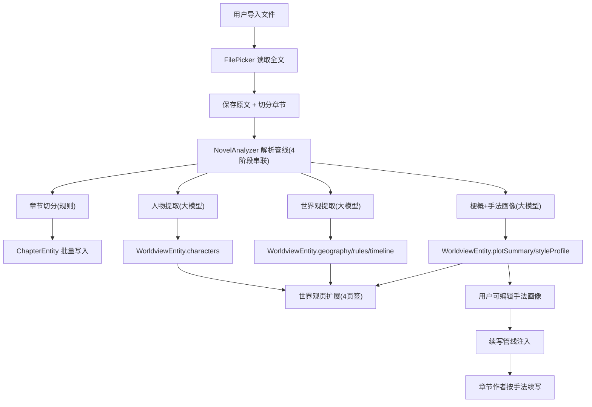

# 小说上传与原作者手法续写

Feature Name: novel-import-continuation
Updated: 2026-08-10

## Description

用户导入本地小说（TXT/Markdown/EPUB 文本），应用自动完成章节切分与深层结构解析（人物、世界观、情节梗概、手法画像），并以可编辑的手法画像指导章节作者按原作者风格续写。解析结果为 4 阶段自动串联，失败阶段可单独重试；结果在现有世界观页扩展展示。

## Architecture



解析管线复用 `LlmGateway`（与创作管线同一客户端），独立于创作状态机，使用专用 `AnalysisSession` 跟踪 4 阶段进度。

## Components and Interfaces

### 数据层

| 组件 | 说明 |
|------|------|
| `NovelEntity` | 新增 `source: NovelSource` 枚举字段（`ORIGINAL`/`IMPORTED`），标识导入书籍 |
| `ImportedTextEntity`（新表 `imported_texts`） | `novelId`(FK, CASCADE)、`fullText: String`，保存原文全文 |
| `WorldviewEntity` | 新增 `plotSummary: String`（情节梗概）、`styleProfile: String`（手法画像，可编辑） |
| `ChapterEntity` | 复用现有实体存储切分后的章节（title/content/index） |
| `NovelRepository` | 新增 `importNovel(fileName, fullText)`（建书+存原文）、`saveAnalysisResult(...)`、`getImportedText(novelId)` |
| `NovelDao` | 新增 `upsertImportedText`、`getImportedText`、`upsertWorldview`（含新字段） |

### 解析层（新增 `domain/analysis/`）

| 组件 | 说明 |
|------|------|
| `AnalysisPhase`（枚举） | `SPLIT_CHAPTERS / CHARACTERS / WORLDVIEW / PLOT_STYLE / COMPLETED / FAILED` |
| `AnalysisState` | phase、message、error、各阶段输出切片 |
| `AnalysisSession` | 分析状态机，`update`/`markActive`/`reset`（仿 `CreationSession`） |
| `NovelAnalyzer` | `analyze(request, session): Flow<AnalysisEvent>`，4 阶段串联，失败 emit `AnalysisError` 后中止该阶段可重试 |
| `AnalysisEvent` | `PhaseStarted/PhaseFinished(agentId, output)/ChapterSplitResult/Error/Completed` |
| `ChapterSplitter` | 规则式章节切分：匹配 `第X章/第X回/Chapter X/卷X`，返回章节标题列表与切分位置 |
| `PromptTemplates` | 扩展 `analysisAgent(id)`：`character-extractor`、`worldview-extractor`、`plot-style-analyzer` 三个中文提示词；章节切分为纯规则不进大模型 |

### 续写改造

| 组件 | 说明 |
|------|------|
| `PipelineRequest` | 新增 `styleProfile: String?`、`plotSummary: String?`（导入书籍续写时注入） |
| `ContextManager` | `buildChapterContext` 增加 `styleProfile` 参数，追加"【写作手法指令】严格模仿以下作者手法…" |
| `PromptTemplates` | `agent("chapter-author")` 的 system prompt 追加手法模仿指令说明（当注入手法画像时生效） |
| `NovelCreationUseCase` | 新增 `runContinuation(...)` 入口：读导入书的人物/世界观/梗概/手法画像，组装 `PipelineRequest` 后走原管线 |
| `ChapterEntity` | 续写章节追加进 `IMPORTED` 书籍的章节序列（index 接续） |

### UI 层

| 组件 | 说明 |
|------|------|
| `BookDetailScreen` | 新增"解析档案"入口（仅 `IMPORTED` 书籍显示）；新增"继续续写"按钮（读取解析结果后跳创作配置页） |
| `ImportScreen`（新） | 文件选择 + 书名输入 + "开始解析"按钮，跳转 `AnalysisRunScreen` |
| `AnalysisRunScreen`（新） | 解析进度展示（4 阶段状态 + 当前输出），失败显示重试按钮 |
| `WorldviewScreen` | 扩展为 4 页签：人物设定 / 世界观 / 情节梗概 / 手法画像；手法画像页签可编辑并保存 |
| `WorldviewViewModel` | 增加 `plotSummary`、`styleProfile` 状态与 `saveStyleProfile()` |
| `AppNavHost` | 增加 `import`、`analysisRun` 路由 |

## Data Models

```kotlin
enum class NovelSource { ORIGINAL, IMPORTED }

@Entity(tableName = "imported_texts", foreignKeys = [ForeignKey(NovelEntity::class, parentColumns=["id"], childColumns=["novelId"], onDelete = CASCADE)], indices=[Index("novelId")])
data class ImportedTextEntity(
    @PrimaryKey(autoGenerate = true) val id: Long = 0,
    val novelId: Long,
    val fullText: String,
    val createdAt: Long = System.currentTimeMillis()
)
```

`WorldviewEntity` 新增字段 `plotSummary: String = ""`、`styleProfile: String = ""`。

`ChapterSplitter` 输出：`SplitResult(title, content)` 列表；无章节标记时回退为整篇一章。

## Correctness Properties

- 同一书籍同一时刻仅允许一个解析任务运行（`AnalysisSession` 单 RUNNING 约束）。
- 解析失败保留已完成的阶段产物，重试仅从失败阶段继续。
- 续写注入顺序固定：前文摘要 → 人物库 → 世界观 → 情节梗概 → 手法画像；超限时优先压缩前文摘要与旧章节，手法画像与设定库不截断。
- 章节切分为纯规则解析，不消耗 token、不依赖网络。
- 导入书籍删除时，`imported_texts` 与章节/解析结果级联删除。

## Error Handling

| 场景 | 处理 |
|------|------|
| 文件读取失败/编码不支持 | 导入页展示错误原因，不建书 |
| 大模型解析超时或失败 | 标记该阶段 FAILED，保留已完成阶段；UI 提供"重试该阶段" |
| 无章节标记 | 回退整篇为一章并提示用户 |
| 续写上下文超限 | 压缩前文摘要，保留手法画像完整注入 |
| 解析中途取消 | 中止后续阶段，已存产物保留 |

## Test Strategy

- `ChapterSplitterTest`：各类章节标题格式、无标记回退、乱序标题。
- `NovelAnalyzerTest`（FakeLlmGateway）：4 阶段事件序列、阶段失败重试、取消。
- `ContextManagerTest` 扩展：注入手法画像后 system prompt 包含手法指令；超限时优先压缩前文。
- `NovelRepositoryTest`：导入建书 + 原文存储 + 级联删除。
- UI：导入/解析运行页手动验证。

## References

- requirements.md: 本目录 requirements.md
- WorldviewScreen.kt: ../../../../app/src/main/java/com/ainovel/app/ui/worldview/WorldviewScreen.kt
- WorldviewEntity.kt: ../../../../app/src/main/java/com/ainovel/app/data/local/entity/WorldviewEntity.kt
- NovelEntity.kt: ../../../../app/src/main/java/com/ainovel/app/data/local/entity/NovelEntity.kt
- PipelineRequest.kt: ../../../../app/src/main/java/com/ainovel/app/domain/agent/AgentOrchestrator.kt
- ContextManager.kt: ../../../../app/src/main/java/com/ainovel/app/domain/agent/ContextManager.kt
