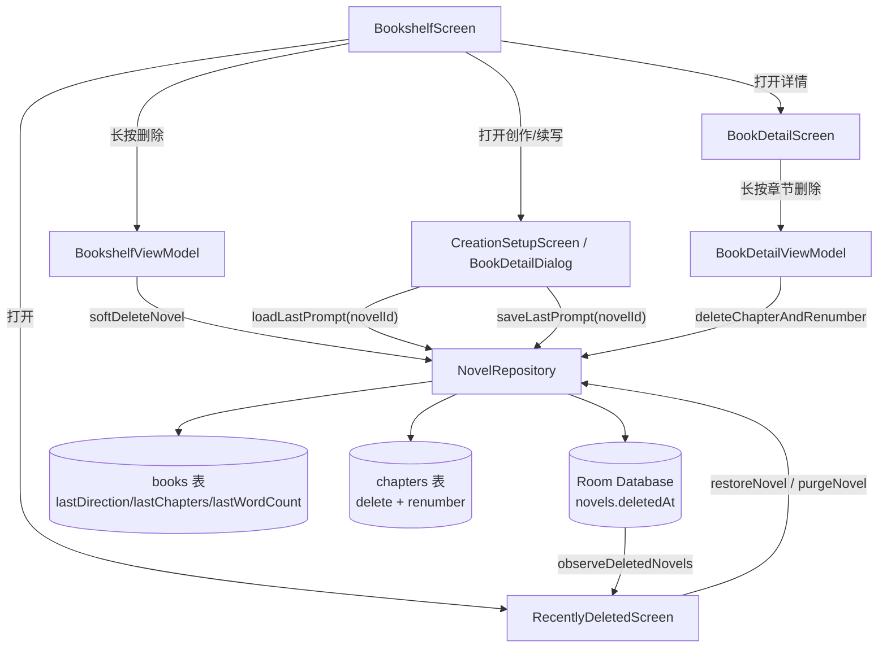
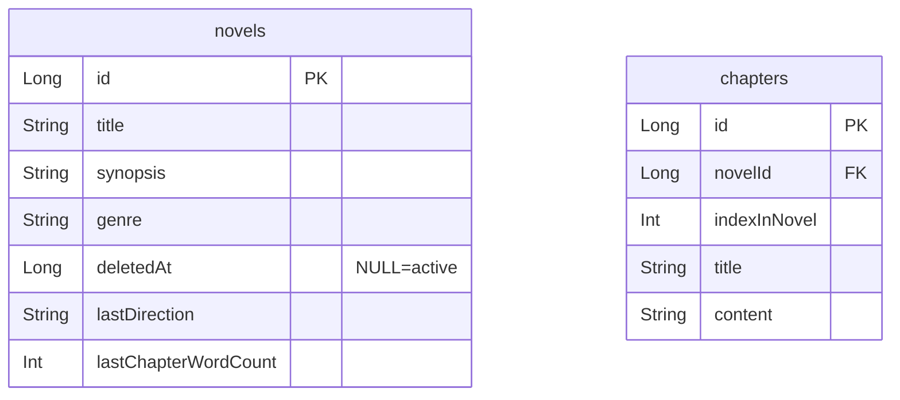

# Recent Delete & Creation Context

Feature Name: recent-delete-and-creation-context
Updated: 2026-08-13

## Description

为 AINovelWriter 新增三项书籍管理能力：

1. **最近删除**：删除书籍进入书架顶部的「最近删除」独立列表页，可恢复或彻底删除（软删除 + 回收站）。
2. **创作提示词回显**：按书持久化最近一次创作/续写提示词（方向、章节数、每章字数），再次打开创作设置页或续写对话框时回显。
3. **章节独立删除**：书籍详情长按章节行可单独删除，删除后重排剩余章节序号，无章节时状态回退为草稿。

## Architecture



## Components and Interfaces

### 1. 最近删除（软删除）

**数据模型变更** — `NovelEntity` 新增字段：

```
val deletedAt: Long? = null   // null 表示未删除；非 null 表示已删除的时间戳
```

**DAO 新增查询**：

- `observeActiveNovels(): Flow<List<NovelEntity>>` — `SELECT * FROM novels WHERE deletedAt IS NULL ORDER BY updatedAt DESC`
- `observeDeletedNovels(): Flow<List<NovelEntity>>` — `SELECT * FROM novels WHERE deletedAt IS NOT NULL ORDER BY deletedAt DESC`
- 现有 `observeNovels()` 改为只返回 `deletedAt IS NULL`，或新增专用查询，书架改为用 `observeActiveNovels`。

**Repository 新增方法**：

- `softDeleteNovel(novelId)` — 取书，置 `deletedAt = now` 后 `updateNovel`
- `restoreNovel(novelId)` — 置 `deletedAt = null` 后 `updateNovel`
- `purgeNovel(novelId)` — 彻底删除（级联删除章节/世界观/大纲/导入文本/聊天/资产/历史）

**UI**：

- `BookshelfScreen` TopBar 新增「最近删除」图标（`Icons.Filled.DeleteSweep`），导航到 `Routes.RECENTLY_DELETED`。
- 长按删除弹窗文案改为「移入最近删除」，不再提示"不可恢复"。
- 新增 `RecentlyDeletedScreen` + `RecentlyDeletedViewModel`：列表展示书与删除时间，每项「恢复」与「彻底删除」按钮，空态提示。

### 2. 创作提示词回显（按书存储）

**数据模型变更** — `NovelEntity` 新增字段：

```
val lastDirection: String = ""     // 最近一次创作/续写方向
val lastChapterWordCount: Int = 0  // 最近一次每章字数
```

（章节数用现有 `totalChapters` 即可，无需新字段。）

**Repository 新增方法**：

- `getNovel(novelId)` 已存在，直接读 `lastDirection` / `lastChapterWordCount`。
- `saveCreationPrompt(novelId, direction, wordCount)` — 更新 `lastDirection`、`lastChapterWordCount`。

**UI**：

- `CreationSetupScreen`（新建）初始化时从 `novelId` 读取该书上次提示词，回显到「创作方向」「章节数」「每章字数」。
  - 新建流程的 `CreationSetupViewModel` 需要能拿到 novelId 或复用已创建的 novel 信息。
- `BookDetailScreen` 的续写/创作对话框初始化时回显 `lastDirection`、`lastChapterWordCount`。
- 确认开始创作/续写后，调用 `saveCreationPrompt` 持久化本次输入。

### 3. 章节独立删除

**Repository 新增方法**：

- `deleteChapterAndRenumber(chapterId)`：
  1. 取章节及其所属 novelId
  2. 删除该章节
  3. 取该书剩余章节按 indexInNovel 升序，重新赋 `indexInNovel = 1..n` 逐个更新
  4. 更新书：`totalChapters = 剩余数`，若剩余数为 0 则 `status = DRAFT`

**UI**：

- `BookDetailScreen` 章节行 `ChapterRow` 支持 `onLongClick`，弹出删除确认对话框。
- 确认后调用 `BookDetailViewModel.deleteChapter(chapterId)`。

## Data Models



## Correctness Properties

1. **软删除不丢失数据**：softDelete 仅置 `deletedAt`，不删除任何关联行。
2. **恢复幂等**：restore 将 `deletedAt` 置回 null，书恢复原样（章节等仍完整）。
3. **彻底删除干净**：purge 级联清除该书全部关联数据，不留孤儿行。
4. **提示词按书隔离**：每本书的 `lastDirection`/`lastChapterWordCount` 独立，互不影响。
5. **章节序号连续**：删除任意章节后，剩余章节 `indexInNovel` 从 1 连续递增。
6. **空书状态回退**：章节数为 0 时书状态为 `DRAFT`。

## Error Handling

| 场景 | 处理 |
|------|------|
| 删除的书不存在 | softDelete/restore/purge 直接返回，不抛错 |
| 恢复已彻底删除的书 | 返回 false 或忽略（数据已不存在） |
| 章节不存在或已被删 | deleteChapterAndRenumber 直接返回 |
| 删除章节后阅读位置越界 | Reader 的 currentIndex 用 `coerceIn` 钳制（现有逻辑已处理） |

## Test Strategy

- **软删除/恢复/彻底删除**：Robolectric + in-memory Room 测试 `NovelRepository`，验证 deletedAt 切换、级联清除、书架列表过滤。
- **提示词持久化**：测试 `saveCreationPrompt` 写入与读取，以及按书隔离。
- **章节重排**：测试删除中间章/首章/末章后的 `indexInNovel` 连续性与 `totalChapters` 更新；空书回退 DRAFT。
- **UI 冒烟**：MainActivitySmokeTest 增加「最近删除列表打开/恢复」与「详情页章节长按删除」路径。
- **迁移**：新增 `Migration2To3`，为 novels 表添加 `deletedAt`、`lastDirection`、`lastChapterWordCount` 列。

## References

[^1]: (Filename app/src/main/java/com/ainovel/app/data/local/AppDatabase.kt) - 数据库定义与版本
[^2]: (Filename app/src/main/java/com/ainovel/app/data/local/dao/NovelDao.kt) - DAO 现有查询
[^3]: (Filename app/src/main/java/com/ainovel/app/di/DatabaseModule.kt) - 迁移与构建
[^4]: (Filename app/src/main/java/com/ainovel/app/ui/bookshelf/BookshelfScreen.kt) - 书架删除交互
[^5]: (Filename app/src/main/java/com/ainovel/app/ui/bookdetail/BookDetailScreen.kt) - 详情页章节列表与续写对话框
[^6]: (Filename app/src/main/java/com/ainovel/app/ui/creation/CreationSetupScreen.kt) - 新建创作设置
